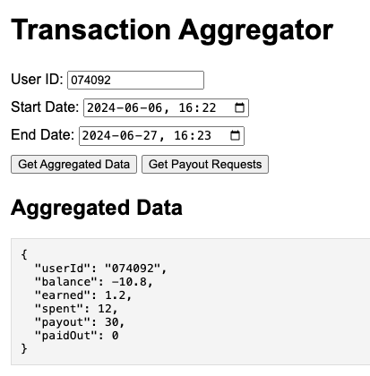
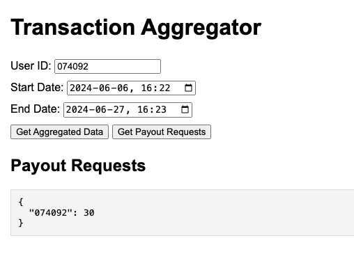
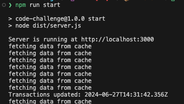

# code-challenge
### Features
- TypeScript
- Testing with Jest
- Local development with Nodemon

### Scripts
#### `npm run build`
Builds the app at `build`, cleaning the folder first.
#### `npm run start`
Starts the app in production by first building the project with `npm run build`.
#### `npm run start:dev`
Starts the application in development using `nodemon` and `ts-node` to do hot reloading.
#### `npm run test`
Runs the `jest` tests once.

### Running the app

1. Installation

```bash
$ npm install
```

2. Build

```bash
$ npm run build
```

3. Start

```bash
$ npm run start
```

4. Open the following address `http://localhost:3000` in browser

### Results


